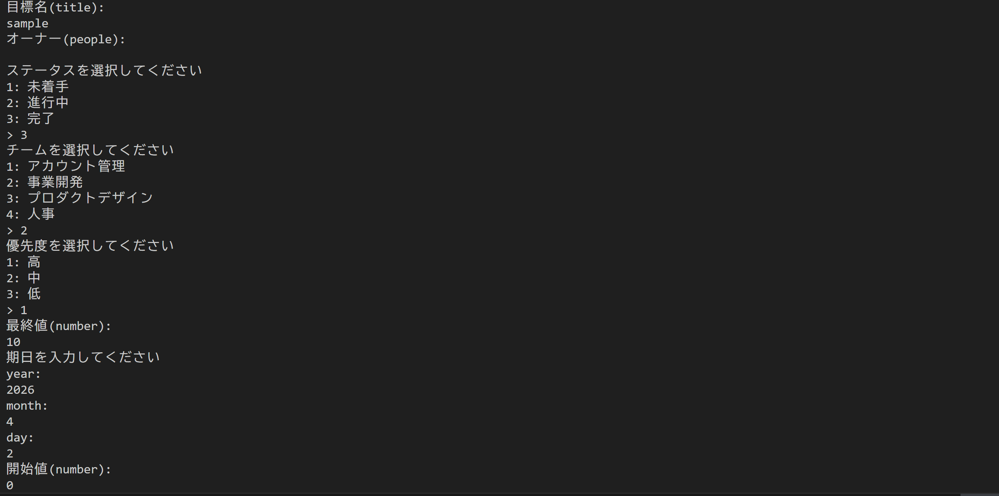

# NotionをCLIから操作するツール

## 目次
* [About](#aboutはじめに)
* [What is NotionGo?](#what-is-notiongonotiongoとは)
* [Why](#whyなぜつくったか)
* [Feature](#feature機能)
* [Installation](#installationインストール)
* [Run](#run実行)
* [Tech Stack](#tech-stack技術スタック)
* [Design](#design設計)
* [Commands](#commandsコマンド)
* [License](#license)

## About/はじめに
このレポジトリはGoで作成したNotionのデータベースをブラウザを介さずにCLIで操作するツールのレポジトリです。

## What is NotionGo?/NotionGoとは?
NotionGoはすでに作成してあるNotionのデータベースのdata_source_idとNotionApiKeyを入力することによりNotionのデータベースを表として出力、データの追加などをすることができるツールになっています。ブラウザを使用することなくNotionのデータを操作できます。

## Why?/なぜつくったか
Notionはさまざまなプラットフォームで使用でき、大変便利なツールなのですがターミナルを離れ、ブラウザ上で操作しなければならないのが少し煩わしいと感じることがありました。そこで本ツールではNotion APIを使用してターミナル上でデータベースを操作することを目的として開発しました。

## Introduction/説明
このREADEMEでは日本語で解説を行っています。

## Feature/機能
* Notionデータベースのスキーマを動的に取得
* プロパティタイプに応じたデータ操作
* CLI上でのインタラクティブなデータ入力
* 完全一致、部分一致による検索機能

## Installation/インストール
Go言語開発環境で以下のコマンドを実行することで、依存関係をインストールできます。
```
git clone https://github.com/sskohei/NotionGo.git
cd NotionGo
go mod download
```

## Run/実行
Go言語開発環境に入り、以下のコマンドを実行して操作したいNotionデータベースのdata_source_idとそれが接続されているインテグレーションのAPIキーを登録します。
### Windows(PowerShell)
```
$env:DATA_SOURCE_ID="YOUR_DATA_SOURCE_ID"
$env:NOTION_API_KEY="YOUR_NOTION_API_KEY"
```
### Mac/Linux
```
export DATA_SOURCE_ID="YOUR_DATA_SOURCE_ID"
export NOTION_API_KEY="YOUR_NOTION_API_KEY"
```

そして以下を実行することで任意のコマンドを実行できます。
```
go run main.go <コマンド>
```

## Tech Stack/技術スタック
このツールは、以下のような技術スタックを採用しています。

* Go
* Notion API - 接続したNotionのデータベースやページを操作できるAPI
* CLI(flag package) - コマンドライン引数を解析・取得するためのGoの標準ライブラリ
* tablewriter - 表を出力するためのGoライブラリ

## Design/設計
このプロジェクトは主にGo言語で構築されています。
### ディレクトリ構造
```
NotionGo/
├──base/            　# NotionAPIとの通信
│   ├──addData.go   　# データ追加
│   ├──deleteData.go　# データ削除
│   ├──filter.go    　# 検索機能
│   ├──pages.go     　# データベース取得
│   ├──schema.go    　# データベースのプロパティを取得
│   ├──table.go     　# 表として出力
│   └──...
├──cmd/             　# コマンドの定義・入力処理       
│   ├──add.go       　# addコマンド(データの追加)
│   ├──contain.go   　# containコマンド(部分一致での検索)
│   ├──delete.go    　# deleteコマンド(データの削除)
│   ├──equal.go       # equalコマンド(完全一致での検索)
│   ├──list.go      　# listコマンド(表として出力)
│   ├──properties.go　# propertiesコマンド
│   ├──query.go     　# queryコマンド
│   └──...
├──model/             # 型定義
│   └──column.go      # データの型を定義    
├──go.mod
├──go.sum
└──main.go
```
本ツールは、「スキーマ駆動設計」をベースに実装しています。
### 汎用CLI設計
Notionデータベースのプロパティ構造を取得し、それをもとに挙動を設定しています。これにより任意のデータベースに対して同一のコマンドで操作可能です。

### プロパティタイプによる拡張性
select / multi_select / titleなどの各プロパティに対して処理を分離しています。新しいプロパティを追加することも最小限の変更で対応可能です。

### インタラクティブなCLI
データ追加（addコマンド実行）時には、取得したスキーマをもとにプロンプトを生成しています。

* 選択肢があるプロパティ → 候補を提示
* テキストプロパティ → 自由入力

### レイヤーの分割
以下の構成により、保守性・可読性を向上させています。

* base : Notion APIとの通信
* cmd : CLIコマンドの定義と入力処理
* model : データ構造の定義

### 今後の拡張性
* update（更新）機能の追加
* 複数のデータベースの登録

## Commands/コマンド

### list
```
go run main.go list
```
Notionデータベースを表として出力します。


### equal,contain
```
go run main.go equal(contain) -k "検索したいキーワード" -p "検索したいプロパティ"
```
使用例

```
go run main.go equal -k "2万人の新規ユーザーを獲得する" -p "目標名"
```
このコマンドを実行すると下記の画像のような表が出力されます。

equalコマンドは指定したプロパティの中でキーワードに完全一致するものがあるか検索できます。

```
go run main.go contain -k "売上" -p "目標名"
```
このコマンドを実行すると下記の画像のような表が出力されます。

containコマンドは指定したプロパティの中でキーワードに部分一致するものがあるか検索できます。

### add
```
go run main.go add
```
新しいデータを追加するコマンドです。このコマンドを実行すると下記の画像のように表示されます。

このように提示されるプロパティに対して情報を打ち込むことで、新しいデータを追加できます。

データの追加に成功すると、下記の画像のように表が出力されます。


### delete
```
go run main.go delete -k "削除したいデータの名前" -p "指定するプロパティ名"
```
データをNotionデータベースから削除するコマンドです。

使用例
```
go run main.go delete -k "sample" -p "目標名"
```
このコマンドを実行し、成功すると[add](#add)で追加したデータが削除され下記の画像のように表が出力されます。


### properties
```
go run main.go properties
```
操作しているNotionデータベースのプロパティ名とタイプ、選択肢があるときはOptionsとして選択肢を出力します。


### query
```
go run main.go query
```
JSON形式でNotionデータベースのデータを表示します。


## License
このプロジェクトはライセンスの下で公開されています。詳細は[LICENSE](LICENSE)ファイルを参照してください。
