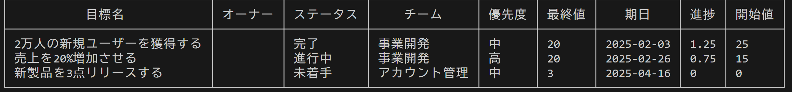

# CLIでNotionのデータベースを操作する

## 目次
・[About](#about)

・[概要](#概要)

・[説明](#説明)

・[ダウンロード](#ダウンロード)

・[インストール](#インストール)

・[実行](#実行)

## About
このレポジトリはGoで作成したNotionのデータベースをCLIで操作するツールのレポジトリです。

## 概要
NotionGoはすでに作成してあるNotionのデータベースのdata_source_idとNotionApiKeyを入力することによりNotionのデータベースを表として出力、データの追加をすることができるツールになっています。

## 説明
このREADEMEでは日本語で解説を行っています。他言語圏の方は機械翻訳を使用することを推奨いたします。

## 機能
・Notionデータベースを表として出力

・データの検索

・データの追加

・データの削除

## ダウンロード
現時点ではリソースを公開していません。 ご利用の際は、当リポジトリからリソースを直接ダウンロードし、ローカルにおいて解凍してください。

## インストール
Go言語開発環境で以下のコマンドを実行することで、依存関係をインストールできます。
```
git clone https://github.com/sskohei/NotionGo.git
cd NotionGo
go mod download
```

## 実行
Go言語開発環境に入り、以下のコマンドを実行して操作したいNotionデータベースのdata_source_idとそれが接続されているインテグレーションのApiキーを登録します。
```
$env:DATA_SOURCE_ID="YOUR_DATA_SOURCE_ID"
$env:NOTION_API_KEY="YOUR_NOTION_API_KEY"
```
そして以下を実行することで任意のコマンドを実行できます。
```
go run main.go <コマンド>
```


## コマンド一覧

### list
```
go run main.go list
```
Notionデータベースを表として出力します。



### equal,contain
```
go run main.go equal(contain) -k "検索したいキーワード" -p "検索したいプロパティ"
```
