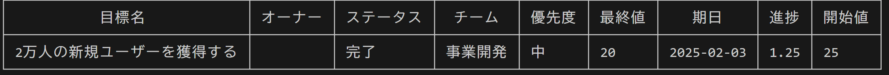
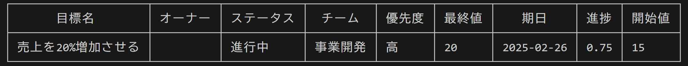
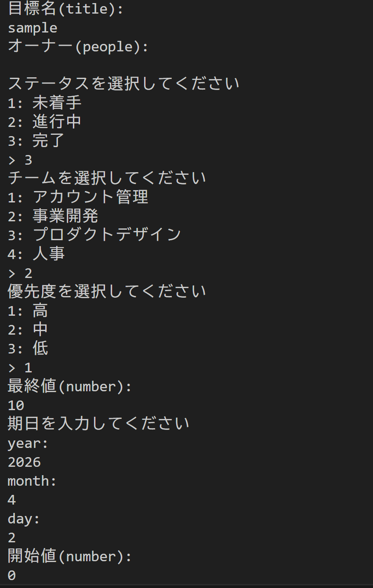
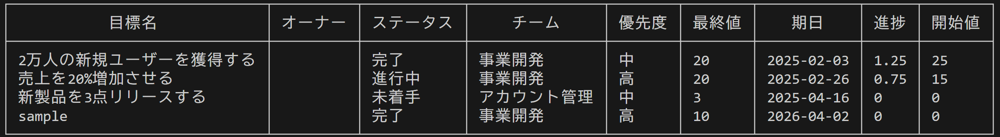
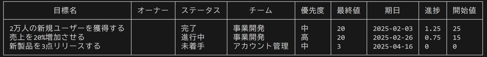
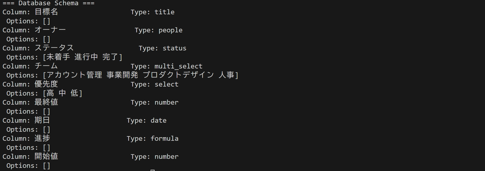
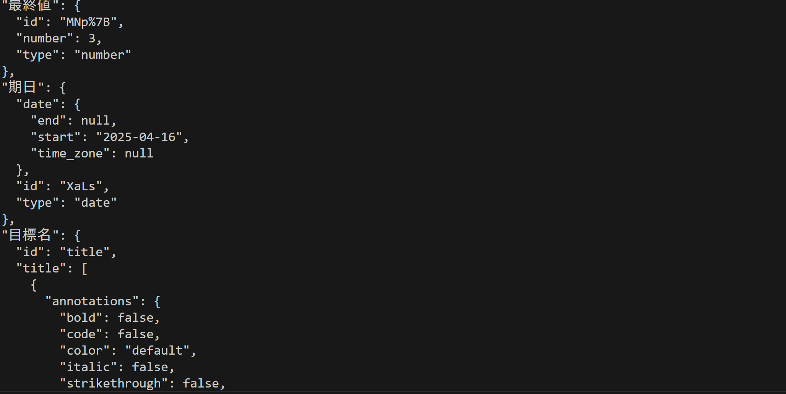

# CLIでNotionのデータベースを操作する

## 目次
・[About](#aboutはじめに)

・[What is NotionGo?](#what-is-notiongonotiongoとは)

・[Introduction](#introduction説明)

・[Downloads](#downloadsダウンロード)

・[Installation](#installationインストール)

・[Run](#run実行)

・[Commands](#commandsコマンド)

・[License](#license)

## About/はじめに
このレポジトリはGoで作成したNotionのデータベースをCLIで操作するツールのレポジトリです。

## What is NotionGo?/NotionGoとは?
NotionGoはすでに作成してあるNotionのデータベースのdata_source_idとNotionApiKeyを入力することによりNotionのデータベースを表として出力、データの追加をすることができるツールになっています。

## Introduction/説明
このREADEMEでは日本語で解説を行っています。他言語圏の方は機械翻訳を使用することを推奨いたします。

## Feature/機能
・Notionデータベースを表として出力

・データの検索

・データの追加

・データの削除

## Downloads/ダウンロード
現時点ではリソースを公開していません。 ご利用の際は、当リポジトリからリソースを直接ダウンロードし、ローカルにおいて解凍してください。

## Installation/インストール
Go言語開発環境で以下のコマンドを実行することで、依存関係をインストールできます。
```
git clone https://github.com/sskohei/NotionGo.git
cd NotionGo
go mod download
```

## Run/実行
Go言語開発環境に入り、以下のコマンドを実行して操作したいNotionデータベースのdata_source_idとそれが接続されているインテグレーションのAPIキーを登録します。
### Windows(PowerShell)
```
$env:DATA_SOURCE_ID="YOUR_DATA_SOURCE_ID"
$env:NOTION_API_KEY="YOUR_NOTION_API_KEY"
```
### Mac/Linux
```
export DATA_SOURCE_ID="YOUR_DATA_SOURCE_ID"
export NOTION_API_KEY="YOUR_NOTION_API_KEY"
```

そして以下を実行することで任意のコマンドを実行できます。
```
go run main.go <コマンド>
```

## Commands/コマンド

### list
```
go run main.go list
```
Notionデータベースを表として出力します。


### equal,contain
```
go run main.go equal(contain) -k "検索したいキーワード" -p "検索したいプロパティ"
```
使用例

```
go run main.go equal -k "2万人の新規ユーザーを獲得する" -p "目標名"
```
このコマンドを実行すると下記の画像のような表が出力されます。

equalコマンドは指定したプロパティの中でキーワードに完全一致するものがあるか検索できます。

```
go run main.go contain -k "売上" -p "目標名"
```
このコマンドを実行すると下記の画像のような表が出力されます。

containコマンドは指定したプロパティの中でキーワードに部分一致するものがあるか検索できます。

### add
```
go run main.go add
```
新しいデータを追加するコマンドです。このコマンドを実行すると下記の画像のように表示されます。

このように提示されるプロパティに対して情報を打ち込むことで、新しいデータを追加できます。

データの追加に成功すると、下記の画像のように表が出力されます。


### delete
```
go run main.go delete -k "削除したいデータの名前" -p "指定するプロパティ名"
```
データをNotionデータベースから削除するコマンドです。

使用例
```
go run main.go delete -k "sample" -p "目標名"
```
このコマンドを実行し、成功すると[add](#add)で追加したデータが削除され下記の画像のように表が出力されます。


### properties
```
go run main.go properties
```
操作しているNotionデータベースのプロパティ名とタイプ、選択肢があるときはOptionsとして選択肢を出力します。


### query
```
go run main.go query
```
JSON形式でNotionデータベースのデータを表示します。


## License
このプロジェクトはライセンスの下で公開されています。詳細は[LICENSE](LICENSE)ファイルを参照してください。
